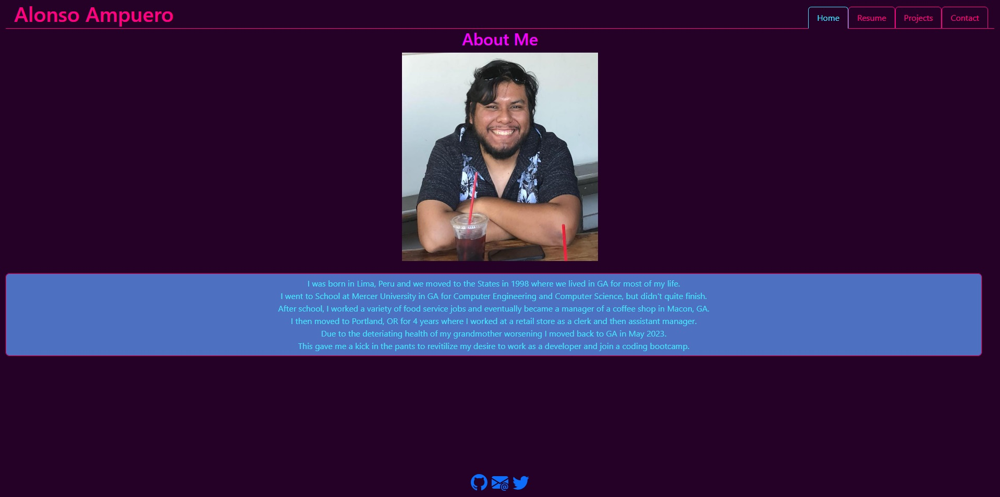
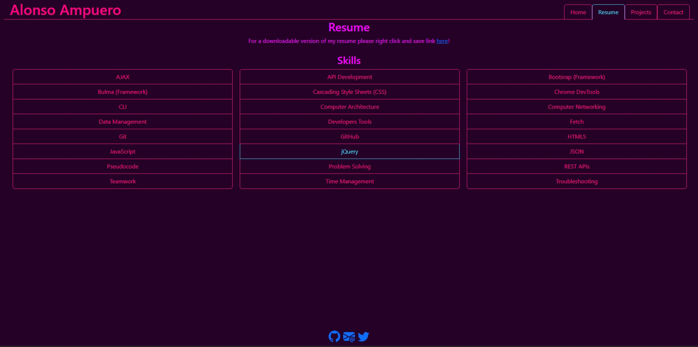
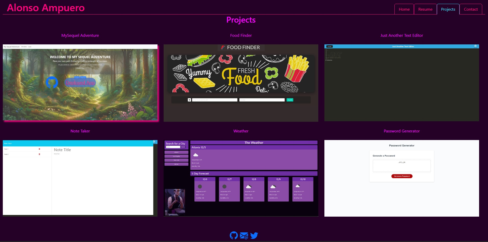
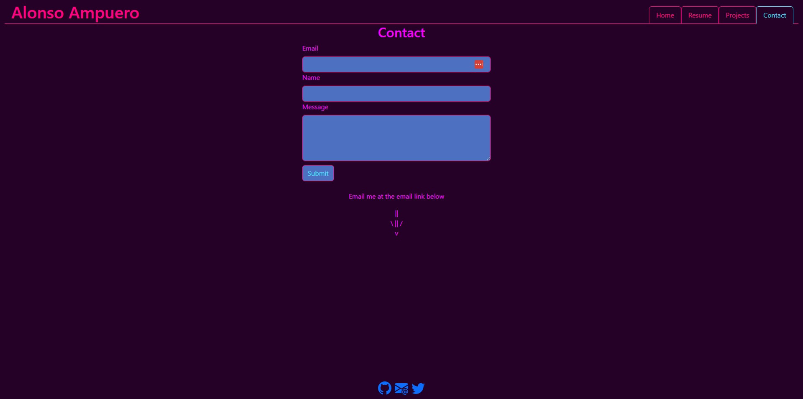

# React-Porfolio

## Description
Portfolio for my projects using React to develop the front end 
[Deploy Link](https://main--alonso-portfolio-react.netlify.app/)

## Table of Contents
[Technology Used](#technology-used) 
[Usage](#usage) 
[Learning Points](#learning-points) 
[Credits](#credits) 
[Author](#author) 

## Technology Used
|Technology Name|Resource|
|-----------|------------|
|JavaScript|[Link](https://www.w3schools.com/js/js_intro.asp)|
|Git|[Link](https://www.w3schools.com/git/git_intro.asp?)|
|HTML|[Link](https://developer.mozilla.org/en-US/docs/Learn/Getting_started_with_the_web/HTML_basics)|
|CSS|[Link](https://developer.mozilla.org/en-US/docs/Web/CSS)|
|React|[Link](https://react.dev/)|
|Vite|[Link](https://vitejs.dev)|
|ESLint|[Link](https://eslint.org/)|
|Netlify (Deployment)|[Link](https://www.netlify.com/)|

## Usage
Allows prospective employers to view a front-end only website that I developed with React and be able to see some of my work.

Main Page has an about me section  
    
Resume Page contains some of my skils with a link to my resume that can be downloaded  
    
Projects page that shows some of the work I've done  
    
Contact page is a non-functional representation of using React to allow for filling out of a form, the footer on every page has links to Github, email, and LinkedIn

## Learning Points
Got a deeper undestanding of React, how to pass properties through components and conditional rendering.

## Author
Alonso Ampuero  
[Twitter](https://www.twitter.com/fenri.ragni)  
[Github](https://www.github.com/fenri.ragni)  
[Portfolio](https://main--alonso-portfolio-react.netlify.app/)